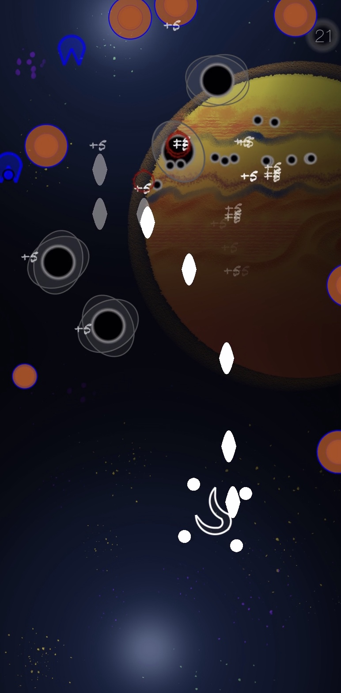
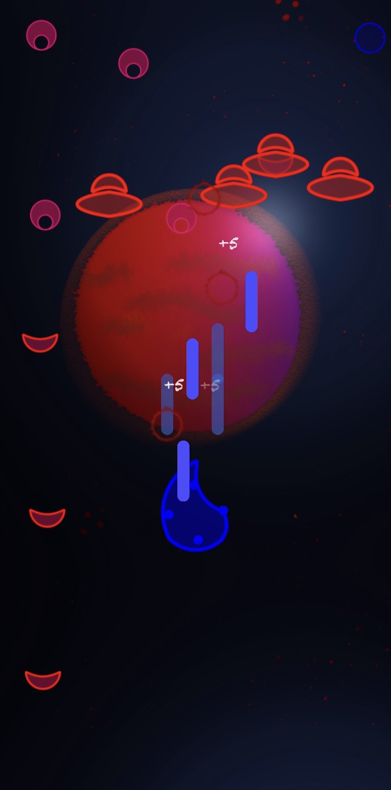

    

    <a href="https://apps.apple.com/it/app/element-eyes/id1509916197">
    

### Have fun in the app game Element Eyes!

  

    
  

  

    
  

### Story

The mysterious eyes invaded the Solar System, choose an element and upgrade it to defeat them!

### Features

 
- 4 Elements to choose: Water, Fire, Air, Earth

- Each Element has 5 upgrades:

  * Elemental: Basic Fire Rate, upgrade it to increase the frequency.
  * Alchemy: It gives a short period of invulnerability against 
    several enemies.
  * Equilibrium: Balance between offensive and defensive power.
  * Power: Your Elemental Fire Rate becomes stronger and larger and 
    piercing, useful with strong enemies.
  * Special (Unique cool down ability of the Element):
    Activate it with a double tap anywhere on the screen.

- Incremental Boss Fights and 9 challenger levels.

- You can progress all the 4 elements in parallel.

- Auto-Saving after starting a new planet and after having defeated a boss.

- End game mode after the main story with increased difficulty 

### Support or Contact

If you need support for Element Eyes app you can contact me at andrea.dellaira1989@gmail.com

    
