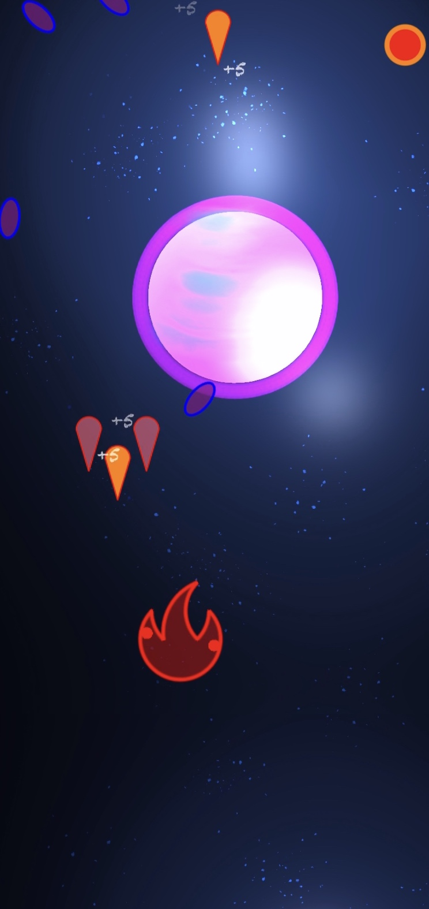
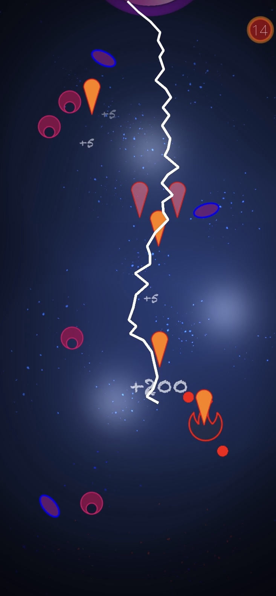

    

    

https://apps.apple.com/it/app/element-eyes/id1509916197

  

    
  

  

    
  

  

    
  

### Story

    

 The mysterious eyes invaded the Solar System, choose an element and upgrade it to defeat them!

### Features

 *   4 Elements to choose: Water, Fire, Air, Earth

 *   Each Elements has 5 upgrades: 
    Elemental, Alchemy, Equilibrium, Power, Special 

 *  Incremental Boss Fights and challenger levels 

 *  You can progress all 4 elements in parallel.

### Enjoy and have fun in Element Eyes!

### Support or Contact

If you need support for Element Eyes app you can contact me at andrea.dellaira1989@gmail.com

    
